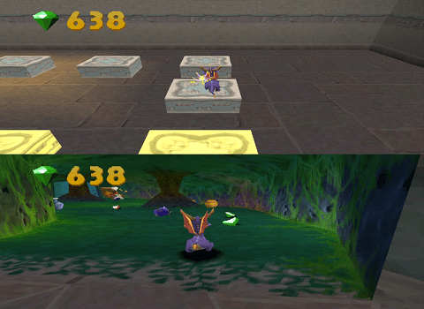

# Spyro 2x2

A split-screen co-op mod for the original Spyro 2 game!

## Installation ⚙️

| Version                  | Patch file                     | CUE file                 | SBI file                 | SHA-1 checksum                           |
| -------                  | ------------------------------ | ------------------------ | ------------------------ | ---------------------------------------- |
| Ripto's Rage [NTSC]      | [Download][spyro2x2_rr.xdelta] | [Download][spyro2x2.cue] | Not needed               | b3a28f8c5ec02dfbd1f9bd47adbe1d75186a5d3f |
| Gateway to Glimmer [PAL] | [Download][spyro2x2_gg.xdelta] | [Download][spyro2x2.cue] | [Download][spyro2x2.sbi] | c394b2d061b7ea6f693275f92a622191db57c7e5 |

You should possess a copy of the game in a `.cue/.bin` file format. Download the patch file corresponding to your version and apply it to you `.bin` file. For convenience, you can do it using this website: https://kotcrab.github.io/xdelta-wasm/. It will give you a patched `.bin` file, rename it to `spyro2x2.bin` and place it in a directory. Download the `.cue` file (and the `.sbi` file for PAL version) and place it in the same directory. Then, launch the `.cue` file from your emulator and enjoy!

## How to play 🎮

Connect a second controller in your emulator, then player 2 will be able to interact. The screen is only split when in a level, not in the menus nor during dialogues.

I highly recommend you to overclock the CPU in your emulator up to 300% for a better experience as it can be laggy. Not more than 300% or the game will crash between levels.

If your friend is not next to you and you want to remote play, there are solutions like Remote Play Together (Steam) or Parsec. For instance, you can use RetroArch with Beetle PSX on Steam and invite your friend thanks to Remote Play Together.

### PvP 🔥

You can flame your friend.

### Skin color 🎨

Hold `SELECT` and press the corresponding button to change your skin color. Press `SELECT` alone to get back the purple color.

| Buttons               | Color  |
| --------------------- | ------ |
| `SELECT` + `TRIANGLE` | Green  |
| `SELECT` + `CIRCLE`   | Red    |
| `SELECT` + `CROSS`    | Blue   |
| `SELECT` + `SQUARE`   | Pink   |
| `SELECT` + `UP`       | White  |
| `SELECT` + `DOWN`     | Black  |
|                       |        |
| `SELECT`              | Purple |

## Trouble with the mod, eh? 🚧

Feel free to [open an issue](https://github.com/Spyromain/Spyro2x2/issues/new) for whatever you want:
-   You got a problem to patch or play the game.
-   You found a severe bug that blocks a player or crashes the game.
-   You have some suggestions to improve the mod.
-   You just want to say something.

## How to build from source (for advanced users) 🛠️

### Prerequisites

-   A gcc mipsel compiler
    -   Example for Windows: [mipsel-none-elf from grumpycoder](https://static.grumpycoder.net/pixel/mips/)
    -   Example for Linux: `apt install gcc-mipsel-linux-gnu`
-   [Python 3](https://www.python.org/downloads/)
-   [mkpsxiso](https://github.com/Lameguy64/mkpsxiso)

### Build

1.  Edit the `env.mk` file to specify the path of each required program.
2.  Open a terminal and `cd` to the directory of the project you want to build:
    -   `cd projects/rr` for Ripto's Rage [NTSC]
    -   `cd projects/gg` for Gateway to Glimmer [PAL]
3.  Place you ROM file (renamed `spyro2.bin`) inside the `disc` directory where `rom_file_goes_here.txt` resides.
4.  Enter the command `make setup`, it will extract files from your ROM.
5.  Enter the command `make`, it will build the Spyro 2x2 ROM in `build/disc/spyro2x2.bin`.

## Special thanks 🐲

-   [Unofficial Spyro Scope](https://github.com/FranklyGD/Spyro-Scope)
-   [PSX Modding Toolchain](https://github.com/mateusfavarin/psx-modding-toolchain)
-   [mkpsxiso](https://github.com/Lameguy64/mkpsxiso)
-   [grumpycoder Windows binaries](https://static.grumpycoder.net/pixel/mips/)
-   [xdelta-wasm](https://github.com/kotcrab/xdelta-wasm)
-   [Mod the Dragon](https://discord.com/invite/z3BbjANWCz) (discord server)
-   [PSXDEV Network](https://discord.com/invite/p5ES9TBf) (discord server)

[spyro2x2_rr.xdelta]: https://github.com/Spyromain/Spyro2x2/releases/download/v1.0.0/spyro2x2_rr.xdelta
[spyro2x2_gg.xdelta]: https://github.com/Spyromain/Spyro2x2/releases/download/v1.0.0/spyro2x2_gg.xdelta
[spyro2x2.cue]: https://github.com/Spyromain/Spyro2x2/releases/download/v1.0.0/spyro2x2.cue
[spyro2x2.sbi]: https://github.com/Spyromain/Spyro2x2/releases/download/v1.0.0/spyro2x2.sbi
